<h1 align="center"> Word Palindrome Check, Number Guessing, Sort Number and Word </h1>
<h2 align="center"> AUTHOR: LE THIEN AN TRAN </h2>
<h3> 1. About It </h3> 

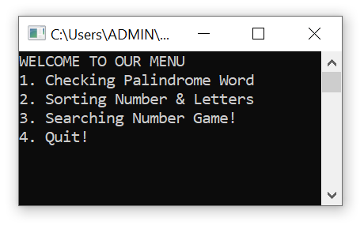 

This is the program that I made in my second year at college in order to practice two pointers, and algorithms. This program can be used for:
<ul>
<li> Sorting number (ascending order and descending order) and words (from A to Z and from Z to A) </li>
<li> Check if the word is palindrome or not </li>
<li> There is a guessing game entertainment, the program already has 10 numbers (from 1-100), the user just need to guess and see if the number is in the program or not. </li>
</ul>

<h3> 2. How It Was Made? </h3>

The program is very simple to make and fun for practice. I use: 
<ul> 
<li> Selection sort algorithm to sort the numbers and words in order </li>
<li> Two pointers for palindrome checking 
<li> Binary search algorithm for the guessing game </li>
</ul>

<h3> 3. What I Learned? </h3>

I have learned tons of things new when doing this. I was quite new to the algorithm, but this help me understand better and improve my mindset logically. 
<ol>
<li> Multiple sorting algorithm and its complexity (bubble sort, selection sort, insertion sort, merge sort and quick sort). But in this case, simple sort as selection sort is more useful. </li>
<li> Two pointers technique across the arrays </li>
<li> Binary Search Algorithm. </li>

<h3> 4. Tools </h3> 

<ul> <li> Visual Studio </li> <li> .NET </li> </ul>

<h3> 5. Screenshots of the programs </h3>

<ul> 
<li> Word Palindrome:
 
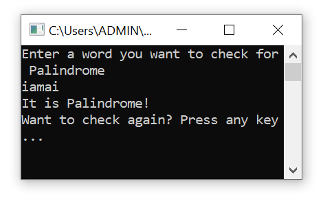
</li>
<li> Number Sorting: 
 
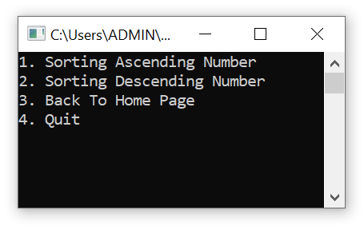
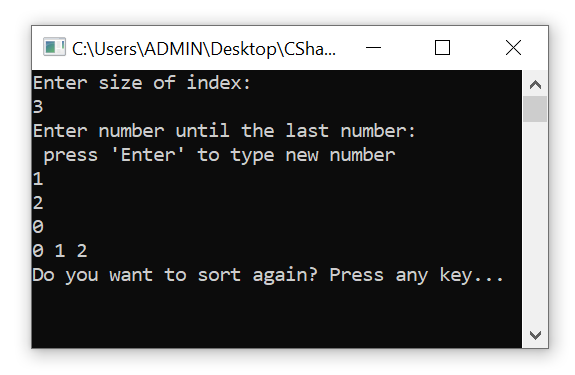
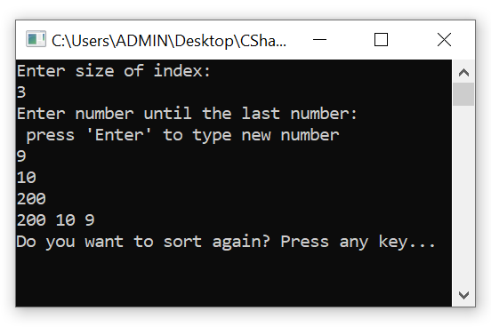
 
 &nbsp &nbsp &nbsp Menu &nbsp &nbsp &nbsp &nbsp &nbsp &nbsp &nbsp &nbsp &nbsp &nbsp &nbsp &nbsp &nbsp &nbsp &nbsp &nbsp &nbsp &nbsp &nbsp &nbsp &nbsp &nbsp &nbsp &nbsp &nbsp &nbsp Ascending Sort   &nbsp &nbsp &nbsp &nbsp &nbsp &nbsp &nbsp &nbsp &nbsp &nbsp &nbsp &nbsp &nbsp &nbsp &nbsp Descending Sort </li>
<li> Word Sorting: 
 
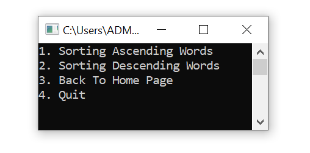
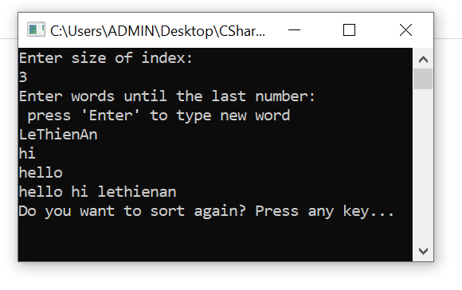
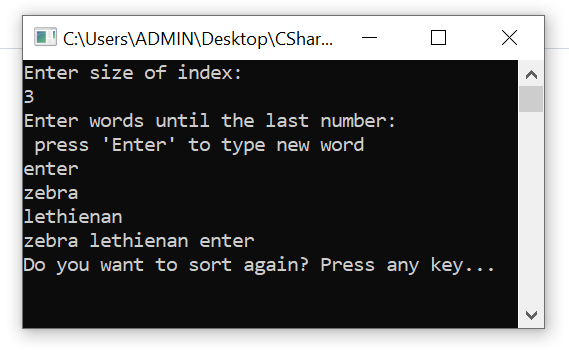
 
&nbsp &nbsp &nbsp &nbsp &nbsp &nbsp Menu &nbsp &nbsp &nbsp &nbsp &nbsp &nbsp &nbsp &nbsp &nbsp &nbsp &nbsp &nbsp &nbsp &nbsp &nbsp &nbsp &nbsp &nbsp &nbsp &nbsp &nbsp &nbsp &nbsp &nbsp &nbsp &nbsp Ascending Sort   &nbsp &nbsp &nbsp &nbsp &nbsp &nbsp &nbsp &nbsp &nbsp &nbsp &nbsp &nbsp &nbsp &nbsp &nbsp Descending Sort </li>
<li> Guessing Game: 
 
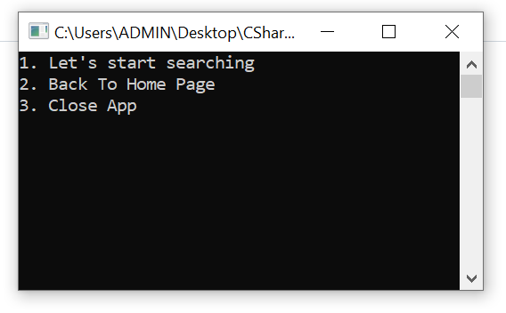
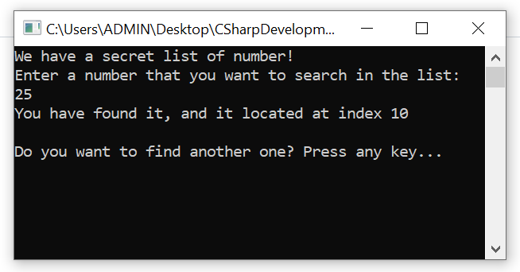
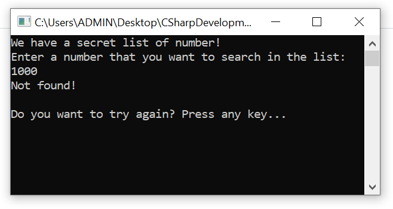
 
&nbsp &nbsp &nbsp &nbsp &nbsp &nbsp Menu &nbsp &nbsp &nbsp &nbsp &nbsp &nbsp &nbsp &nbsp &nbsp &nbsp &nbsp &nbsp &nbsp &nbsp &nbsp &nbsp &nbsp &nbsp &nbsp &nbsp &nbsp &nbsp &nbsp &nbsp &nbsp &nbsp Number Found   &nbsp &nbsp &nbsp &nbsp &nbsp &nbsp &nbsp &nbsp &nbsp &nbsp &nbsp &nbsp &nbsp &nbsp &nbsp  &nbsp &nbsp &nbsp &nbsp &nbsp &nbsp Number Not Found </li>

